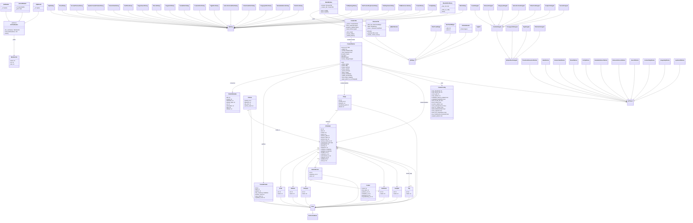

# STL Database — Class Diagram

```mermaid
classDiagram
    %% ─── Database Layer ──────────────────────────────────────────────────────
    class DeclarativeBase
    class Base { }
    Base --|> DeclarativeBase

    class STLModel {
        +id: int
        +title: str
        +creator: str
        +source: str
        +archive_path: str
        +archive_hash: str
        +archive_size: int
        +archive_mtime_ns: int
        +compression_rate: float
        +presupports: str
        +warning: str
        +sequence: int
        +created_at: datetime
        +updated_at: datetime
        +sculptor_id: int
        +collection_id: int
        +subcollection_id: int
        +category_id: int
        +release_id: int
        +scale_id: int
    }
    STLModel --|> Base

    class Image {
        +id: int
        +model_id: int
        +filename: str
        +thumbnail_path: str
        +dhash: str
    }
    Image --|> Base
    Image "many" --> "1" STLModel : model_id

    class STLFile {
        +model_id: int
        +filename: str
        +file_size: int
        +archive_hash: str
    }
    STLFile --|> Base
    STLFile "many" --> "1" STLModel : model_id

    class Tag {
        +id: int
        +name: str
    }
    Tag --|> Base
    STLModel "many" <--> "many" Tag : model_tags

    class Sculptor {
        +id: int
        +name: str
    }
    Sculptor --|> Base
    STLModel "many" --> "1" Sculptor

    class Collection {
        +id: int
        +name: str
    }
    Collection --|> Base
    STLModel "many" --> "1" Collection

    class Subcollection {
        +id: int
        +collection_id: int
        +name: str
    }
    Subcollection --|> Base
    Subcollection "many" --> "1" Collection
    STLModel "many" --> "1" Subcollection

    class Category {
        +id: int
        +name: str
    }
    Category --|> Base
    STLModel "many" --> "1" Category

    class Release {
        +id: int
        +name: str
    }
    Release --|> Base
    STLModel "many" --> "1" Release

    class Scale {
        +id: int
        +name: str
    }
    Scale --|> Base
    STLModel "many" --> "1" Scale

    class Creator {
        +name: str
        +full_name: str
        +patreon_url: str
        +artstation_url: str
        +gumroad_url: str
        +myminifactory_url: str
    }
    Creator --|> Base

    class CrawledFolder {
        +id: int
        +path: str
        +pattern: str
        +last_crawled_at: datetime
        +archive_count: int
        +new_count: int
        +updated_count: int
    }
    CrawledFolder --|> Base

    %% ─── Config ──────────────────────────────────────────────────────────────
    class CrawlerConfig {
        +max_thumbnails: int
        +max_thumb_size: int
        +unrar_path: str
        +max_workers: int
        +metadata_sidecar_enabled: bool
        +metadata_thumbnails: bool
        +store_stl_file_list: bool
        +force_rescan: bool
        +recurse_subdirs: bool
        +warn_presupported_stl: bool
        +warn_no_images: bool
        +warn_nested_archive: bool
        +warn_supports: bool
        +warn_low_compression: bool
        +low_compression_threshold: float
        +support_patterns: list
    }

    %% ─── Crawler Layer ───────────────────────────────────────────────────────
    class QThread
    class CrawlerWorker {
        +source_dir: Path
        -_pattern: str
        -_config: CrawlerConfig
        -_stop_requested: bool
        +progress signal
        +log signal
        +finished signal
        +counts_changed signal
        +run()
        -_phase_hash()
        -_phase_diff()
        -_phase_extract()
        -_phase_upsert()
        -_upsert_archive()
        -_detect_rules()
        -_assign_metadata()
        -_update_thumbnails()
        -_store_folder_images()
        -_apply_pattern_to_unchanged()
    }
    CrawlerWorker --|> QThread
    CrawlerWorker --> CrawlerConfig : uses
    CrawlerWorker --> STLModel : creates/updates
    CrawlerWorker --> Image : creates/updates
    CrawlerWorker --> CrawledFolder : updates

    class ArchiveReader {
        <<abstract>>
        +iter_members() MemberInfo
        +read_batch(names) dict
        +close()
    }
    class _ZipReader {
        -_zf: ZipFile
    }
    _ZipReader --|> ArchiveReader

    class _SevenZReader {
        -_zf: SevenZipFile
        -_path: Path
    }
    _SevenZReader --|> ArchiveReader

    class _RarReader {
        -_rf: RarFile
    }
    _RarReader --|> ArchiveReader

    class MemberInfo {
        +name: str
        +crc: int
        +size: int
    }
    ArchiveReader --> MemberInfo : yields

    class ModelMetadata {
        +title: str
        +creator: str
        +distributor: str
        +release_date: str
        +url: str
        +description: str
        +tags: list
        +release: str
    }
    CrawlerWorker --> ModelMetadata : consumes

    %% ─── UI Layer — Main Windows ──────────────────────────────────────────────
    class QMainWindow
    class QWidget
    class QDialog

    class MainWindow {
        -_browser: BrowserTab
        -_crawler_tab: CrawlerTab
        +open_config()
        +open_crawler()
    }
    MainWindow --|> QMainWindow
    MainWindow --> BrowserTab : hosts
    MainWindow --> CrawlerTab : hosts

    class BrowserTab {
        -_filter_tree: FilterTreeWidget
        -_table: QTableView
        -_proxy: _BrowserProxyModel
        +refresh()
        -_populate_filter_tree()
        -_header_context_menu()
    }
    BrowserTab --|> QWidget

    class CrawlerTab {
        -_worker: CrawlerWorker
        +close_requested signal
        +progress_updated signal
        +crawl_finished signal
        -_start_crawl()
        -_browse_folder()
        -_autofill_pattern()
    }
    CrawlerTab --|> QWidget
    CrawlerTab --> CrawlerWorker : creates/controls

    %% ─── UI Layer — Custom Widgets ────────────────────────────────────────────
    class FilterTreeWidget {  }
    FilterTreeWidget --|> QWidget

    class BarChartWidget {
        -_data: list
        -_total: int
    }
    BarChartWidget --|> QWidget

    class ClickableLabel {
        +clicked signal
    }
    ClickableLabel --|> QWidget

    class TagEdit { }
    TagEdit --|> QWidget

    %% ─── UI Layer — Dialogs ───────────────────────────────────────────────────
    class EditorDialog { }
    EditorDialog --|> QDialog

    class MassEditorDialog {
        -_clear_cbs: dict
        -_make_ac_edit()
        -_save()
    }
    MassEditorDialog --|> QDialog

    class ConfigDialog { }
    ConfigDialog --|> QDialog

    class CrawlerDialog { }
    CrawlerDialog --|> QDialog

    class DbMaintenanceDialog { }
    DbMaintenanceDialog --|> QDialog

    class FindDuplicatesDialog { }
    FindDuplicatesDialog --|> QDialog

    class FindContentDuplicatesDialog { }
    FindContentDuplicatesDialog --|> QDialog

    class FindByImageDialog { }
    FindByImageDialog --|> QDialog

    class StatisticsDialog { }
    StatisticsDialog --|> QDialog

    class MetadataSidecarDialog { }
    MetadataSidecarDialog --|> QDialog

    class CategoryEditorDialog { }
    CategoryEditorDialog --|> QDialog
    class CollectionEditorDialog { }
    CollectionEditorDialog --|> QDialog
    class SubcollectionEditorDialog { }
    SubcollectionEditorDialog --|> QDialog
    class TagEditorDialog { }
    TagEditorDialog --|> QDialog
    class CreatorEditorDialog { }
    CreatorEditorDialog --|> QDialog
    class ScaleEditorDialog { }
    ScaleEditorDialog --|> QDialog

    class ImageGridDialog { }
    ImageGridDialog --|> QDialog
    class FileListDialog { }
    FileListDialog --|> QDialog
    class ImageViewerDialog { }
    ImageViewerDialog --|> QDialog
    class SortFilesDialog { }
    SortFilesDialog --|> QDialog
    class ColumnStatsDialog { }
    ColumnStatsDialog --|> QDialog
    class UpdateCrawledFoldersDialog { }
    UpdateCrawledFoldersDialog --|> QDialog
    class RecrawlPreviewDialog { }
    RecrawlPreviewDialog --|> QDialog
    class AboutDialog { }
    AboutDialog --|> QDialog
    class HelpDialog { }
    HelpDialog --|> QDialog

    %% ─── UI Layer — Delegates ─────────────────────────────────────────────────
    class QStyledItemDelegate
    class _ComboDelegate { }
    _ComboDelegate --|> QStyledItemDelegate
    class SourceDelegate { }
    SourceDelegate --|> _ComboDelegate
    class SculptorDelegate { }
    SculptorDelegate --|> _ComboDelegate
    class CollectionDelegate { }
    CollectionDelegate --|> _ComboDelegate
    class SubcollectionDelegate { }
    SubcollectionDelegate --|> _ComboDelegate
    class CategoryDelegate { }
    CategoryDelegate --|> _ComboDelegate
    class ReleaseDelegate { }
    ReleaseDelegate --|> _ComboDelegate
    class ScaleDelegate { }
    ScaleDelegate --|> _ComboDelegate
    class PresupportsDelegate { }
    PresupportsDelegate --|> QStyledItemDelegate
    class TagDelegate { }
    TagDelegate --|> QStyledItemDelegate
    class FilterItemDelegate { }
    FilterItemDelegate --|> QStyledItemDelegate

    %% ─── UI Layer — Background Workers ───────────────────────────────────────
    class ThumbnailGeneratorWorker { }
    ThumbnailGeneratorWorker --|> QThread
    class StatsWorker { }
    StatsWorker --|> QThread
    class ColumnStatsWorker { }
    ColumnStatsWorker --|> QThread
    class DHashWorker { }
    DHashWorker --|> QThread
    class VerifyWorker { }
    VerifyWorker --|> QThread
    class MetadataSidecarWorker { }
    MetadataSidecarWorker --|> QThread
    class RemoveSidecarsWorker { }
    RemoveSidecarsWorker --|> QThread
    class _SearchWorker { }
    _SearchWorker --|> QThread
    class _ContentDupWorker { }
    _ContentDupWorker --|> QThread
    class _ImageDupWorker { }
    _ImageDupWorker --|> QThread
    class _UpdateAllWorker { }
    _UpdateAllWorker --|> QThread
```
